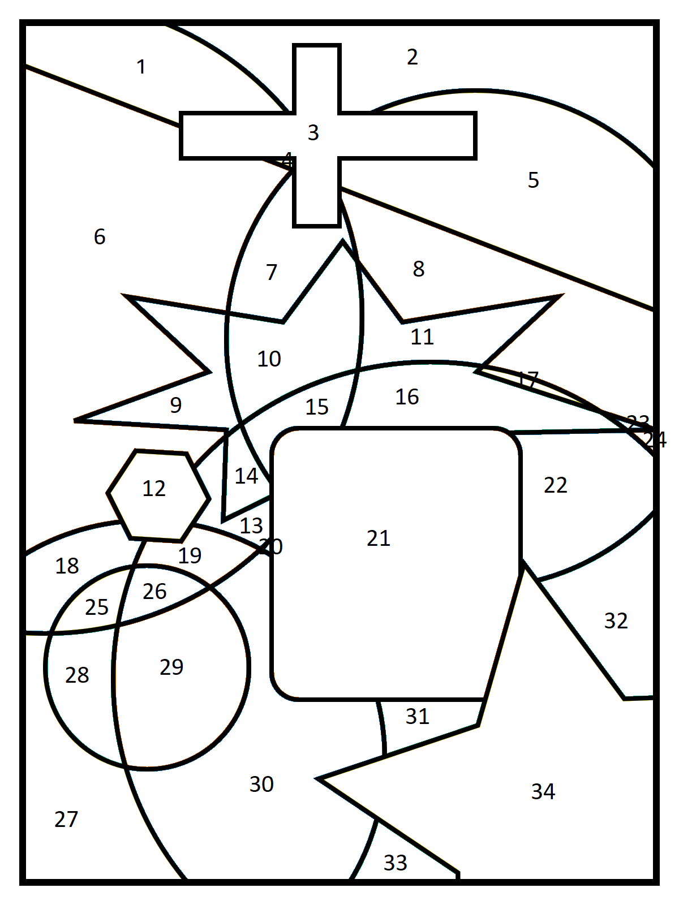
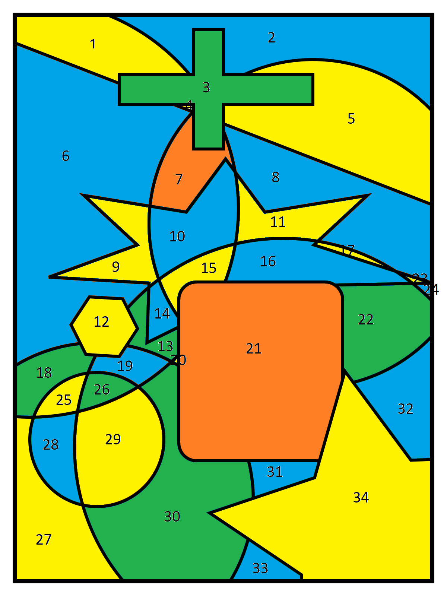

## Estructura de datos: Caso 1
# Diego Granados Retana
# 14 de agosto

Para demostrar el teorema del four color, yo definí la siguiente estructura de datos.

`struct region {
    short color = 0; 
    vector<short> adyacentes = {};
    short ubicacion; 
    vector<short> coloresUsados = {}; 
};
`

La variable short se usa para almacenar el color de cada región, el vector adyacentes contiene las secciones adyacentes o contiguas a la región, la variable ubicación se va a usar para identificar cada región y el vector coloresUsados se va a usar para almacenar los colores que tienen los adyacentes y por ende no pueden ser usados por la región.

La estructura de datos se va a usar para representar cada sección o región del mapa. Para crear el mapa, utilicé un vector, cuyos elementos son regiones.

Hice la función containColor() para ver si un color estaba o no en un conjunto de colores.

Para colorear el mapa, el algoritmo va iterando por cada región.

Primero, se ordena la lista de adyacentes con base en la cantidad de adyacencias que tiene cada región. Esto se hace por la razón que se explicará más adelante.

Luego, se revisa si la cantidad de colores usados, o sea que no están disponibles, es mayor a la cantidad de colores disponibles. Si lo es, eso significa que no se va a poder asignar un color a la región actual. Para solucionar esto, hay que cambiar el color de las regiones adyacentes suficientes para liberar un color.

Primero, se itera por cada región adyacente para ver si tiene otros colores disponibles. Si los hay, busca cuál es y cuando lo encuentra, revisa si este es diferente al color actual. Si lo es, asigna el color actual, el que se va a liberar, a una variable que se llama cambio, para luego cambiar las regiones con solo ese color y ahorrar tiempo y evitar cambios que tal vez más bien afecten el proceso. 

Luego, borra el color a liberar de la lista de colores usados de la región actual, no de los adyacentes. Esta instruccion es la razón por la cual se ordena la lista de adyacentes. Para eliminar un elemento de un vector, se utiliza un iterador. Como no se puede comparar un iterador con un short, utilicé la variable elem para comparar los colores. Para borrar el color correcto, la lista tiene que estar en orden, ya que el color a comparar tiene que coincidir con la posición en la lista. 

Finalmente, se cambia el color de la región adyacente por el nuevo y se actualizan las listas de adyacentes de las secciones contiguas a la misma adyacente, ya que si se necesita cambiar el color de estas, esas listas necesitan tener los datos más nuevos. Con esto se termina el ciclo.

Después de cambiar los colores, vuelve a recorrer la lista de adyacentes y actualizar la lista de colores usados. Si después de la actualización el tamaño de la lista sigue siendo igual o mayor a la cantidad de colores, el mapa no se puede colorear y se despliegan todas las regiones adyacentes, sus colores, los colores usados y un mensaje de error. Esto es para que el usuario pueda ver qué fue lo que falló, si digitó mal el mapa o algún error similar.

Para concluir, el algoritmo busca el primer color disponible y lo asigna a la región. Luego, actualiza las listas de adyacentes de cada sección adyacente a la región, para que cuando se les tenga que poner un color, no puedan tener el mismo color que se acaba de poner.

Después de recorrer todo el mapa, si no hubo ningún error, imprime un mensaje de éxito.

Para probar el algoritmo se utilizaron dos mapas. Para los dos, el color 1 es amarillo, el 2 azul, el 3 verde y el 4 anaranjado. 

El primero es el siguiente.

Luego de colorearse con el algoritmo, queda así.

El segundo es así.

Luego de colorearse con el algoritmo, queda de esta manera.

